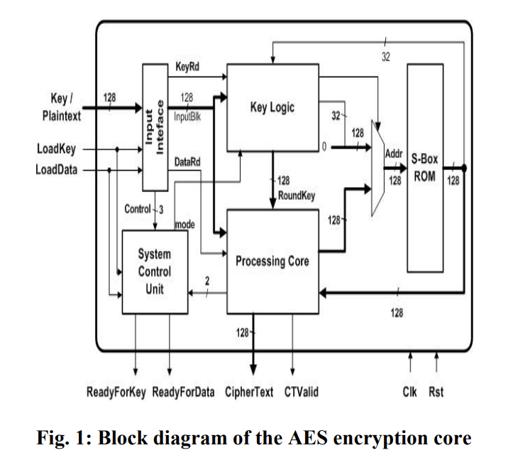
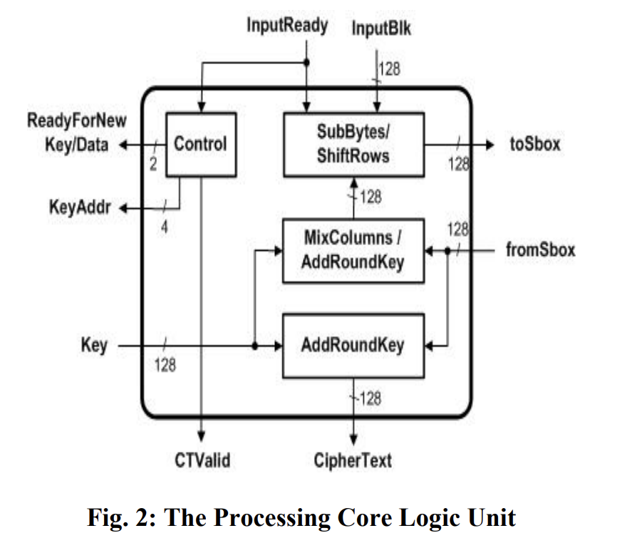
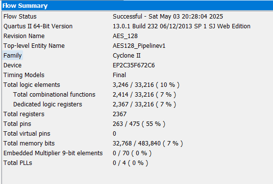

# **AES-128 Encryption Core**
This project is a Verilog implementation of the AES-128 encryption algorithm, designed based on the architecture proposed in the paper "*A High-Speed and Area Efficient Hardware Implementation of AES-128 Encryption Standard*". The design focuses on achieving a good balance between throughput and resource usage, suitable for FPGA-based applications.  
This implementation was developed as part of my self-study in digital hardware design. The project helped me gain hands-on experience in datapath and control logic design, as well as performance-area trade-offs in cryptographic cores. While this design follows the architecture of the paper closely, certain adjustments were made during implementation to suit my specific learning objectives and target FPGA platform.

## **Architecture Diagram**
The architecture of this AES-128 encryption core is designed based on the structure presented in the paper "*A High-Speed and Area Efficient Hardware Implementation of AES-128 Encryption Standard*".
The design focuses on high-speed encryption while optimizing resource usage, making it suitable for FPGA-based applications with limited hardware resources.  
  
### In this design:  
* **KeyLogic** is responsible for key expansion and generating round keys independently.  

* **Processing Core** performs the encryption operations (SubBytes, ShiftRows, MixColumns, and AddRoundKey) with a 1-stage pipeline, without significantly increasing hardware resource usage. This is one of the interesting points of the paper, achieving an optimal balance between performance and resource utilization. 
  
 
* Both modules share a common **S-Box** for the SubBytes operation, ensuring efficient reuse of hardware resources.

## **Simulation Guide**
1. Install a Verilog simulator
   * Icarus Verilog
2. Compile source code with testbench'
   ```
   iverilog -o AES128_Pipelinev1_tb AES128_Pipelinev1_tb.v
   ```
3. Run the simulator
   ```
   vvp AES128_Pipelinev1_tb
   ```
4. View waveform output
   ```
   gtkwave AES128_Pipelinev1_tb.vcd
   ```

## **Resource Utilization**
* The AES-128 encryption core was successfully synthesized and implemented on the **DE2 FPGA development board**. The resource usage is summarized below


## **Performance**
* The AES-128 encryption core operates at a **maximum frequency of 117.92 MHz** on the DE2 FPGA board, as reported by the Quartus Timing Analyzer. 


